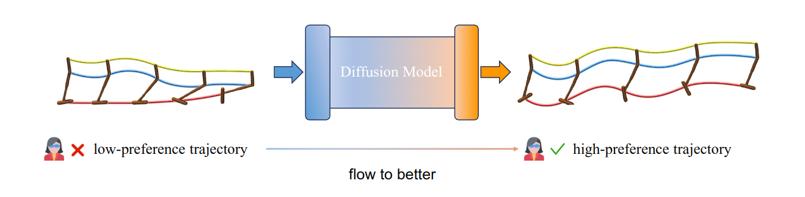

# flow-to-better

Official code for FTB: [Flow to Better: Offline Preference-based Reinforcement Learning via Preferred Trajectory Generation](https://openreview.net/forum?id=EG68RSznLT&referrer=%5Bthe%20profile%20of%20Yang%20Yu%5D(%2Fprofile%3Fid%3D~Yang_Yu5)).




## Usage

First, you need to install Python packages listed in `requirements.txt` using `pip install -r requirements.txt`.

Then, just run the scripts in the `run_scripts` dir. You can try as follows:

For mujoco tasks:

```bash
sh run_scripts/run_mujoco.sh
```

For Metaworld tasks:

```bash
sh run_scripts/run_metaworld.sh
```

For NeoRL tasks:

```bash
sh run_scripts/run_neorl.sh
```


## Citation

If you find this repository useful for your research, please cite:

```bash
@inproceedings{
	zhang2024flow,
	title={Flow to Better: Offline Preference-based Reinforcement Learning via Preferred Trajectory Generation},
	author={Zhilong Zhang and Yihao Sun and Junyin Ye and Tian-Shuo Liu and Jiaji Zhang and Yang Yu},
	booktitle={The Twelfth International Conference on Learning Representations},
	year={2024},
	url={https://openreview.net/forum?id=EG68RSznLT}
}
```
